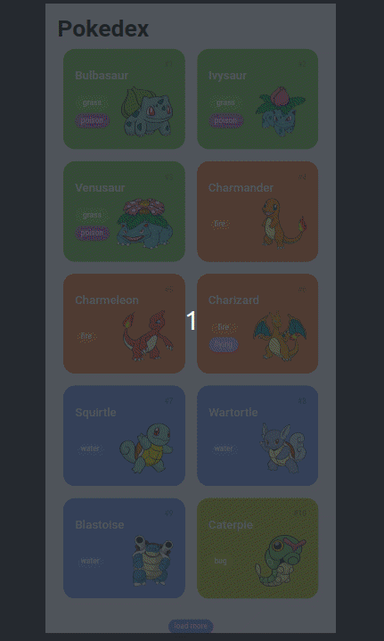

# Pokedex

## :book: Resumo do projeto

Projeto seguindo o curso de HTML5, CSS3 e JavaScript da [DIO](https://web.dio.me/home).

O objetivo do curso é aprender e práticar conseitos do desenvolvimento web, estrutura de uma página web, estilização com CSS3, dinamismo com JavaScript, funcionamento do protocolo HTTP e consumo de REST API.

O projeto desenvolvido é uma pokedex com design inspirado nesse [layout](https://dribbble.com/shots/6540871-Pokedex-App) e utilizando a [PokeApi](https://pokeapi.co/) para fornecer as informações dos pokemons.

## :pushpin: Desafio DIO

O Desafio da [DIO](https://web.dio.me/home) era implementar a tela de detalhes do Pokemon, consumindo as informações fornecidas pela PokeAPI.

Segue abaixo o resultado até o momento.

## :gear: Atualizações futuras
- [ ] Implementar as abas Base stats, Evolution e Moves.
- [ ] Deixar a tela responsiva para outros tamanhos.